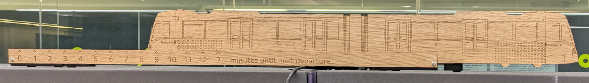
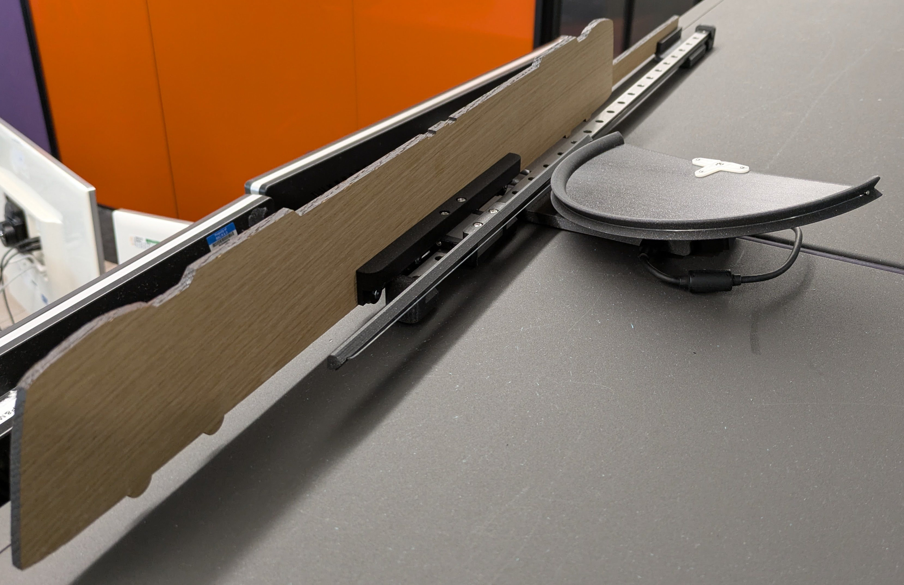

Tram Timer
==========

A model tram which moves along its tracks to indicate how long until the next
departure from a [Manchester Metrolink](https://tfgm.com/ways-to-travel/tram)
tram stop.

Why?
----

There's nothing worse than heading to catch a tram from just outside the office
only to have just missed one, or find one isn't due for ages. Having an
indicator of when the next tram is due means you can always set off at just the
right moment.

This project is the successor to a simple [analogue gauge showing tram
departures I built some years ago](http://jhnet.co.uk/misc/trambox.jpg). Unlike
its predecessor, however, this one can be seen by the whole office.

Design
------

The mechanism centres around a 600mm MGN12H linear rail (available from the
usual dubious suppliers). A laser cut tram rides along this rail propelled by a
standard RC servo driving a rack-and-pinion style linkage.

A Raspberry Pi Pico W microcontroller pulls Metrolink service data from the
[TFGM/BeeNetwork Metrolink Open Data
API](https://tfgm.com/data-analytics-and-insight/open-data-portal) via WiFi to
drive the servo.

Apart from the laser cut tram and linear rail, all other components are 3D
printed. M-series nuts, bolts and brass heat-set inserts connect everything
together.

### Mechanism

The servo and rack and pinion based mechanism was selected for its extreme
simplicity of implementation. With nothing more than 5v from the USB bus and a
3.3v PWM signal directly from a microcontroller, this setup gets you a
closed-loop absolutely-positioned linear actuator.

Rather than using toothed gears, two lengths of fishing line connect the rack
and pinion. This reduces the need for tight mechanical tolerances and makes
operation quieter.

The major downside of the rack and pinion approach is the additional space
taken up by the pinion wheel. Another limitation is that high resolution
movement accuracy is not typically possible given the slop and dead bands of
typical RC servos.

However, more compact or better performing options such as a belt-driven system
would be unjustifiably more complex to implement for relatively unimportant
gains.

### Firmware

The firmware is "the simplest thing that could possibly work". It's written in
[MicroPython](https://micropython.org/) because performance is utterly
irrelevant and microcontrollers have far too much RAM nowadays.

The only interesting quirk is that the Metrolink API returns status information
for every platform on the entire network in a single large JSON blob too large
to fit in RAM once deserialised. As a result, the firmware must incrementally
read and parse the structure.

For the benefit of future custodians of this device, details on flashing and
configuring the firmware can be found in [firmare/README.md](./firmare/README.md)

### CAD

This project was my first using FreeCAD 1.0. After dismissing it as unusable
many years ago, I was delighted to discover the hype around FreeCAD 1.0 is
justified. It may be a long way behind its commercial counterparts but it is by
far the most powerful Open Source graphical 3D CAD tool I'm aware of.

2D CAD for the laser-cut tram was, of course, done in Inkscape. For
authenticity, I did most of the work whilst riding the tram.
